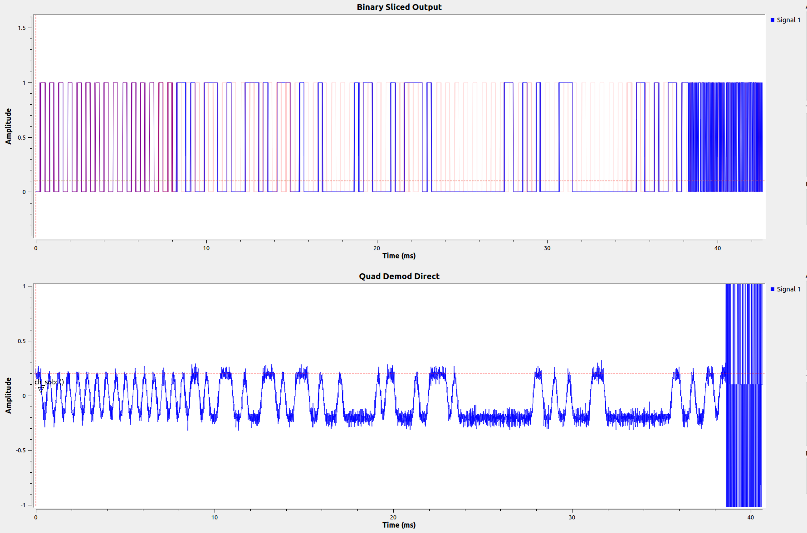

# About

This folder contains information about the RF (433MHz) sensors used to relay zone temperature data back to the control unit.  

# Prerequisites

You will also need to install GNU Radio and GNU Radio companion to run the flowgraph, and python to run the packet decoder.

# Principle of operation

The Advantage Air RF temperature sensors send packets of data to the control box at an interval that varies depending on how quickly the temperature is changing.  

Each packet takes approximately 40ms to transmit.

If the temperature doesn't change, the sensor will only send updates every couple of minutes (sometimes even less frequently).  I believe that if the temperature changes quickly, the updates become more frequent.

The below information was determined with the help of GNU radio, and a USB RTL-SDR tuner, painstakingly searching for spectrum that showed activity and trying to determine the encoding mechanism.  

RTL-SDR tuners can be bought relatively cheaply from a number of vendors.

# Transmission parameters

| Parameter | Value |
| --------- | ----- |
| Carrier Freq | 433.975MHz |
| Modulation | 2FSK |
| Pk-Pk deviation | ~25kHz (probably not particularly accurate) |
| Bit-rate | ~38.4kbps |

# Packet Structure

Packets are sent with:

- 32-bits of clock sync pulses: `10101010101010101010101010101010`.
- 32-bits of word/byte alignment pulses: `0xd391d391` (this is to help determine where the byte boundaries are).
- packet data:
  - 8 bytes of content
  - 2 bytes of CRC

# Packet data content

The structure of the packet data is as follows:

| Ofs | Example Content | Description |
| - | --------------- | ----------- |
| 0x00 | `00000001 01100001 00111101` | Device UID (Example is 0x01613d) |
| 0x03 | `00000000` | Info Byte (bit 6 is set if packet was sent as a result of user pressing the 'pair' button) |
| 0x04 | `00000000 11001001` | Temperature Value (degrees C * 10.0)  215 decimal = 21.5 degrees Celcius Note: The `temp = value / 10` is an approximation, and only seems to be close around 20 degrees.  A lookup table is probably required for more accuracy. |
| 0x06 | `00001110 00000000` | RF transmitter major/minor version |
| 0x08 | `00000110 01001101` | CRC 0x064d |

# CRC algorithm

The CRC algorithm / parameters were determined using [`reveng`](https://reveng.sourceforge.io/).

A large number of messages were captured from the temperature sensors I had, and where particular messages were found to occur three or more times, they were considered "most likely valid" and used for this parameter search.  In this case I chose 4 packets as likely candidates.

The command-line used was:

`./reveng -w 16 -b -s 017e500000c90e00c0d4 017e500000c80e0040c3 017e480000cc0e00008b 017e480000cb0e0080e4`

`width=16  poly=0x8005  init=0xffff  refin=false  refout=false  xorout=0x0000  check=0xaee7  residue=0x0000  name="CRC-16/CMS"`

A python implementation of this algorithm is available in the `aa_crc16.py` file.

