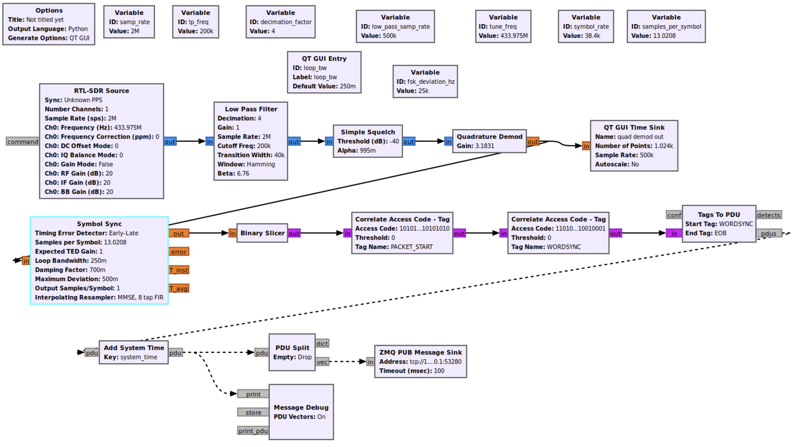

# AA Temperature Sensor Packet Decoding Flowgraph

There are at least two types of sensors that AA systems come with; those with DIP switches to set the sensor ID, and those with an ID that is factory set (so have no DIP switches).

Mine are of the latter variety, so the documentation and flowgraphs below work for these. I don't have access to a DIP-switch based sensor to test.

## New-style sensors without DIP switches

> 

The [`aa_temp_packet_capture.grc`](./aa_temp_packet_capture.grc) flowgraph shown above can be used to capture data from temperature sensors.  

The flowgraph listens for thermometer packet transmissions on 433.975MHz, demodulates the 2FSK signal, handles the bit synchronisation and conversion to a bitstream, finds the sync word and packetises the data into a message PDU, and finally passes the captured PDU to a ZMQ sink.

A small python script [`grc_decode_aa_packet.py`](./grc_decode_aa_packet.py) listens for these ZMQ messages, converts the bits in the message into bytes, and then decodes and displays the data from the packet.

Finally, it should be noted that this was my first time using GRC for anything of this nature, so any suggestions for improvements will be welcomed!  In particular, I still seem to get quite a high number of packets that don't pass the CRC check (seems this is normally due to the final bit being truncated), so I think something is not quite right with the synchronisation or other processing.
